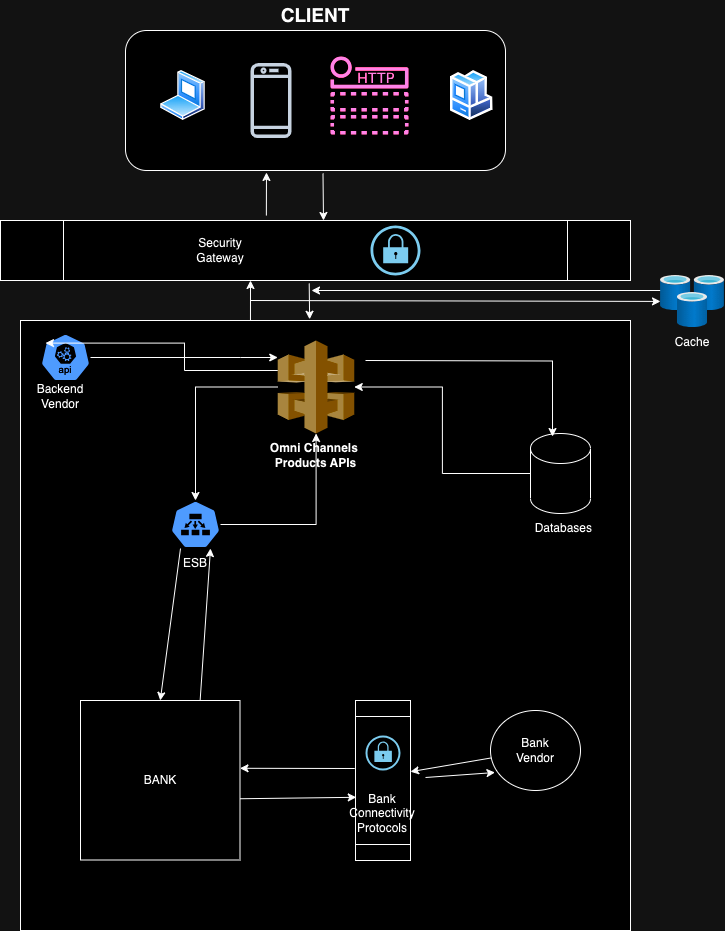

# Exercise 1

## Retail Store Discounts Calculator

This program calculates the net payable amount for a given bill considering various discounts.

### Usage

1. Clone the repository.
2. Compile the Java files.
3. Run the test cases.
4. Check code coverage report.

#### How to Compile

```bash
javac *.java
```

#### Code Coverage Report

```
This solution provides an object-oriented approach with comprehensive test coverage also and adheres 
to best coding practices. 
You can run the tests to verify the functionality and generate code coverage reports for further analysis.
```

#### How to Run Test Cases

```
java -cp .:junit-platform-console-standalone-1.8.2.jar org.junit.platform.console.ConsoleLauncher --class-path . --scan-class-path
```

# Exercise 2

# Financial Institution X

## The Omni Channel Project

### Points

1. Mobile applications
2. Consumes backend services provided by the vendor
3. Changes can be made by request to the vendors
4. Some sort of connection to the bank by EBS
5. Scalability issue
6. Gateway service (authentication, connection protocols) provided by a vendor to the bank
7.

### Point to Consider

1. Add a Web Channel.
2. Add Vendor Channel and APIs
3. Reduce MIPS on Core
4. Strategic Roadmap for Omni-channel Product

**Web Channel**
Based on the information here’s a high-level design for adding a web channel and vendor channel with APIs to the
Financial Institution X’s Omni Channel product, while also addressing the core system MIPS reduction using caching:

* **Web Model:**
For an Omni Channel experience, a Single Page Application (SPA) model would be the best choice as it provides a seamless
and responsive user experience across different devices and platforms.

* **Architecture Diagram with Web Channel Connectivity:**
The Web Channel can connect to the Gateway using secure protocols like HTTPS. The Gateway will handle authentication,
authorization, and routing of requests to the Omni Channel Backend. 

* **Updated version of the system Architecture**




* **Authentication/Authorization Implications:**
The Web Channel will need to implement authentication mechanisms like OAuth 2.0, OpenID Connect, or similar protocols to
authenticate users and obtain access tokens. The Gateway will handle token validation and authorization based on user
roles and permissions.

* **Omni-channel Experience:**
With a SPA model and proper synchronization of user data and state across channels, the Web Channel can provide an
Omni-channel experience seamlessly.

* **Performance Implications and Mitigation:**
Adding a new channel can increase the load on the backend systems. To mitigate performance issues, caching mechanisms
can be implemented at the Gateway or Web Channel level. Load balancing and horizontal scaling of the Web Channel and
Gateway components can also help distribute the load. We can also implement caching static content (e.g., images, CSS, JavaScript) to reduce the number of requests to the server.

**Vendor Channel and APIs**

* **Changes Required:** The Omni Channel product will need to be extended to expose new APIs for vendors. These APIs
  will allow vendors to interact with the system and provide their product data.

* **Backend Freeze Constraints:** Since the ESB and core banking systems are on freeze, the new vendor APIs should
  leverage the capabilities of the Gateway. The Gateway can mediate communication between the Omni Channel product and
  vendor systems using vendor-specific protocols.

* **Vendor Connectivity Management:**  API Gateway can handle vendor connectivity and provide features like
  authentication, authorization, throttling, and monitoring.

* **API Design and Documentation:** The vendor APIs will/should be designed using a RESTful approach and documented
  using OpenAPI Specification (OAS or Swagger). This will allow vendors to easily integrate with the system.

* **Architecture Components:** An API Gateway can manage vendor access and authorization by implementing policies based
  on API keys, digital certificates, or other mechanisms.

**Reduce MIPS on Core**

* **Caching Implications:** Adding new channels (web and vendor) will increase the load on the core systems. Caching can
  be an effective technique to reduce MIPS on the core by storing frequently accessed data closer to the web and mobile
  channels.

* **Caching Solution:**  A distributed caching solution like Redis or Memcached can be implemented in front of the core
  banking systems. This cache can store frequently accessed data (e.g., customer information, product details) and
  reduce the number of requests to the core systems.

* **Caching Installation:** The caching solution can be deployed on the same servers as the Gateway or on separate
  servers depending on the performance requirements.

* **Caching Architecture:** A transitional architecture can involve deploying the cache in front of the mobile app
  channel initially. The long-term architecture can involve caching for all channels (web, mobile app, and vendor) to
  achieve optimal performance.

**Strategic Roadmap to CTO**

* **Omni Channel Product:**  The Omni Channel product is a core component of the financial institution's digital
  strategy. It should be continuously upgraded to support new features and functionalities. However, due to the current
  freeze on the core banking systems, focus on leveraging the Gateway for new functionalities.

* **Long-Term Considerations:** As the freeze on the core banking systems is lifted, the architecture should be
  revisited to explore options for optimizing communication between the Omni Channel product, core systems and the
  Gateway.

**Java Implementation**
While the above solution focuses on the high-level design, as a tech lead the implementation can leverage Java with
frameworks like Spring Boot for developing the web channel and vendor APIs. Spring Security can be used for implementing
authentication and authorization.

This is a high-level overview and would require further detailed design and implementation to fully address all the
requirements.

**My Explanation:**

* The client device vould be any of the mechanisms stated in the client diagram.
* The client interact with the Omni Channel product through the API Gateway using a RESTful API.
* The API Gateway remains responsible for routing requests and responses between the Web Application and the Omni
  Channel product.
* The diagram shows a arrow lines from throughout the implementation showing where connection is coming from and where
  it's going to
* The implementation show how the ESB will flow into the implementation when the freeze is lifted.
* A caching mechanism was been set in place to manage and reduce request time

